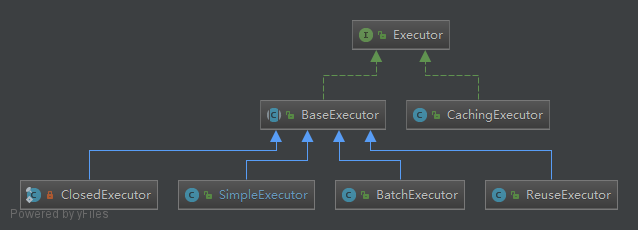
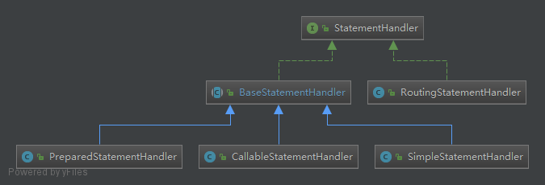
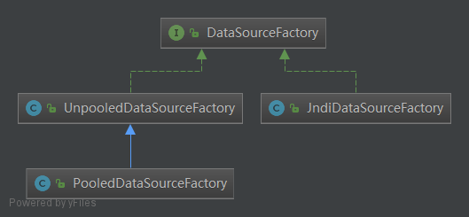

MyBatis SQL Mapper Framework for Java
=====================================

The MyBatis SQL mapper framework makes it easier to use a relational database with object-oriented applications.
MyBatis couples objects with stored procedures or SQL statements using a XML descriptor or annotations.
Simplicity is the biggest advantage of the MyBatis data mapper over object relational mapping tools.

Essentials
----------

* [See the docs](http://mybatis.github.io/mybatis-3)
* [Download Latest](https://github.com/mybatis/mybatis-3/releases)
* [Download Snapshot](https://oss.sonatype.org/content/repositories/snapshots/org/mybatis/mybatis/)

# 学习源码

这个框架的本质是jdbc。

版本：3.4.6-SNAPSHOT

入口类：org.apache.ibatis.session.SqlSessionFactoryBuilder

整体的架构图：

## 进度

- [x] DataSource：org.apache.ibatis.datasource
- [x] Parsing：org.apache.ibatis.parsing
- [x] Transaction：org.apache.ibatis.transaction
- [x] cache：org.apache.ibatis.cache

## 设计模式

1. 工厂模式
2. 建造者
3. 装饰者：对于缓存的包装，所有包装器都是继承与Cache接口，并且构造器都含有Cache参数，当然这是装饰者模式的构造，在Mybatis中使用建造者模式构建cache（默认是lru）对象，并且有默认的装饰器
4. 单例
5. 代理
6. 组合
7. 模板方法
8. 适配器
9. 迭代器
10. 责任链

## 缓存机制

之前一直很好奇，为什么PerpetualCache中使用的是hashmap，这怎么保证线程安全性？看了代码之后才知道，在创建cache的时候，都使用了SynchronizedCache
进行了包装，所以是有的方法都是线程安全的。`CacheBuilder.setStandardDecorators()`

## 重要组件介绍

## 插件机制

对于mybatis的插件机制起作用的几个地方是：

* ParameterHandler
* ResultSetHandler
* StatementHandler
* Executor

在Configuration类当中都能够看到插件的调用。 

## 查询流程介绍

DefaultSqlSession-->Executor-->StatementHandler(ParameterHandler，ResultHandler，TypeHandler)

其中StatementHandler是对sql语句进行预先处理的，ParameterHandler对参数进行处理，ResultHandler对结果进行处理，TypeHandler对数据库类型和java类型转换。

StatementHandler的创建使用的是RoutingStatementHandler，该类是根据StatementType进行路由用的，简单工厂模式。

### Executor

对于Executor结构，主要使用的是装饰者模式，如CacheExecutor（二级缓存）；模板方法模式，如BaseExecutor。
首先对于BaseExecutor来说，一个重要的属性就是一级缓存（默认是session级别的，还有一个statement级别），该类负责一级缓存相关的操作，同时需要注意，一级缓存是在构造器中初始化的，
所以无法关闭，消除缓存影响的方式是，每当使用过一次session之后，清除缓存，也就是需要在sql语句上配置flushCache=true（该属性只针对query操作），
或者配置成statement，那样所有的一级缓存都会失效，那样每次查询都会清除缓存，update会清除缓存,没有delete和insert，使用的都是update方法，同时
在进行操作事务的时候也会清理缓存(看看DefaultSqlSession类的方法)。

#### SimpleExecutor

这个执行器在调用statementHandler进行doQuery或者doUpdate时都会关闭statement。

#### ReuseExecutor

ReuseExecutor在prepareStatement()阶段，判断缓存中是否命中。需要手动执行flushStatements()，关闭statement清除缓存。

#### BatchExecutor

在BatchExecutor中需要手动执行flushStatements()，这样才会真的执行sql语句。

注：对于flushStatement(boolean)，参数为true，只针对batchExecutor有效，因为这个执行器只有在执行该方法时真正的去执行sql，为true就不执行了。
多以这个方法对不同的executor有不同的意义。

### StatementHandler

其中RoutingStatementHandler相当于是一个工厂，按照StatementType创建StatementHandler对象。
而BaseStatementHandler下的结构则是模板方法模式：

* SimpleStatementHandler：相当于是最基本的jdbc的方法调用，如Connection.createStatement().executeQuery()，感觉这个类基本没人使用，哈哈！
* PreparedStatementHandler：使用了预编译，如Connection.PrepareStatement()
* CallableStatementHandler：执行存储过程的

默认的是PreparedStatement(在MappedStatement的构造器中定义)，这个参数的指定时在sql语句中（如xml上）。

### ResultSetHandler

默认实现是DefaultResultSetHandler

### ParameterHandler(针对PreparedStatement)

默认实现是DefaultParameterHandler，使用TypeHandler进行处理。

### TypeHandler(针对PreparedStatement)

实现类有很多，用于对入参和返回参数进行类型处理，转换成java类型已经查询参数设置，也就是针对PreparedStatement进行参数设置和从resultSet获取值。

针对不同的类型有不同的实现类，所以子类很多，这里就不列举了。这里说下BaseTypeHandler类，该类的设计依然是模板模式。同时该类也继承了TypeReference抽象类
，这个类类似于工具类。

## 日志

mybatis为了支持常见的日志实现方式，自定义了Log接口，然后使用门面模式对不同的实现进行包装，并在LogFactory中使用反射的方式按一定的优先级进行构造。

## 数据库连接池

1. JndiDataSourceFactory：该数据源使用JNDI获取数据源，例如和tomcat配合使用（感觉很少使用），tomcat中集成了DBCP连接池。
2. UnpooledDataSourceFactory：就是原生的jdbc的内容。这个类处理了xml配置中的属性。
3. PooledDataSourceFactory：内部使用的是UnpooledDataSource，但是使用jdk的动态代理包装了jdbc的connection(PooledConnection)，这样在
调用connection的close方法就不会真的关闭链接了。*不推荐使用，效率很低。*

下面注重看下PooledDataSource：

预备指数
1. PoolState：该类的所有方法都是synchronized，该类的主要作用是维护两个List<PooledConnection>，以及相关配置属性和池的状态，如平均等待时间，请求次数啊等等。
2. PooledConnection：作为connection的代理类，实现InvocationHandler接口，在调用jdbc的close方法时，将代理的connection，push到连接池当中。 

这个类主要看三个方法（笔记看源码）：

1. pingConnection：检测连接是否合法
2. popConnection： 从池中获取连接
3. pushConnection：将连接放到池中
4. forceCloseAll：关闭所有的链接

## JDBC相关知识

在使用jdbc的connection.createStatement()时，有两个参数ResultSetType和ResultSet。

con.createStatement()：生成的结果集：不滚动、不敏感、不可更新！

con.createStatement(int,int)： 
第一个参数：

*  ResultSet.TYPE_FORWARD_ONLY：不滚动结果集；

*  ResultSet.TYPE_SCROLL_INSENSITIVE：滚动结果集，但结果集数据不会再跟随数据库而变化；

*  ResultSet.TYPE_SCROLL_SENSITIVE：滚动结果集，但结果集数据会再跟随数据库而变化；

第二个参数：

* CONCUR_READ_ONLY：结果集是只读的，不能通过修改结果集而反向影响数据库；

* CONCUR_UPDATABLE：结果集是可更新的，对结果集的更新可以反向影响数据库。

## 问题

1. 三个不同的executor，分别在什么场景下使用？
2. 为什么UnpooledDataSource中使用ConcurrentHashMap？(我感觉不需要)
3. 为什么在PooledDataSource中popConnection方法，synchronized在while循环里面？

